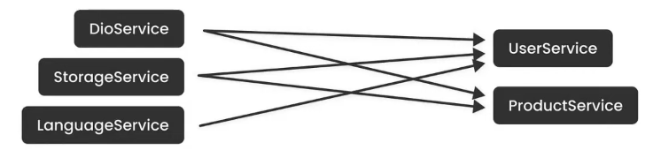
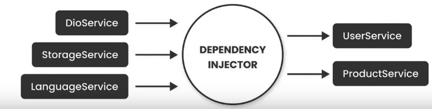

# Dart <3 DI

## План

1. Минутка понимания, зачем вообще DI и что это за зверь такой
2. История ServiceLocator
3. Непосредственно Injectable

## Ремарка 

Так как DI - это не только про мобильную разработку, кода на Flutter будет мало, в основном - чистый Dart

## DI

Придумаем некоторый, заведомо плохой пример (взят из [статьи](https://habr.com/ru/articles/350068/))

```dart
class MyDao { 
  DataSource dataSource;

  MyDao(String driver, String url, String user, String password): 
          dataSource = DataSourceImpl(driver, url, user, password);
  
  //data access methods...
  Person readPerson(int primaryKey) {...}
}
```

Тут нет деталей реализации, тем не менее, можно понять, почему так == плохо. 

1. Неудобно "мОкать". Если `DataSourceImpl` ходит в сеть, а мы хотим вместо этого отдавать постоянные данные (для тестов, например)

2. Пусть эта штука - это конец цепочки зависимостей: `MyDependentClass ->...50 вложенных сущностей... -> MyDao -> DataSourceImpl` (`->` - это знак принадлежности). Тогда чтобы добавить поле в `DataSourceImpl`, надо поменять бесконечно много конструкторов

Решать такую штуку можно, например, так:

```dart
class MyDao {
  final DataSource dataSource;

  const MyDao({required this.dataSource});

  //data access methods...
  Person readPerson(int primaryKey) {
    ...
  }
}

```

Стало определенно лучше, мы точно не тащим бесконечное число аргументов через цепочку зависимостей. 

Теперь возникает проблема, из-за которой всё началось



Число таких зависимостей как бы растет и нам как бы неудобно

Решение хотим видеть примерно таким:



## ServiceLocator

Это первая попытка придумать `Dependency Injector`. 

### На пальцах

Возьмем один такой большой объект и сложим в него всё, что нам может понадобиться. Потом просто будем брать

Тут же поймем, что нам может понадобиться либо новая сущность (NEW) (новый генератор рандома) либо объект, который мы где-то уже используем (SNG)

### На коде 

*Самим кодить не предлагается, просто знать что-как, потому что следующие решения основываются на этом*

Готовимся: 
```dart
class AppModel {
  void update() {
    ...
  }
}

class FactoryTemplate {}

final getIt = GetIt.instance;

void setup() {
  // (SNG)
  getIt.registerSingleton<AppModel>(AppModel());

  // GetIt.I.registerSingleton<AppModel>(AppModel());
  // То же самое, что строчкой выше

  // (NEW)
  getIt.registerFactory<FactoryTemplate>(() => FactoryTemplate());

}

// getIt == GetIt.instance == GetIt.I - это всё одна сущность
```

Используем:
```dart
class App {
  final model = GetIt.I<AppModel>();
}
```

В `get_it` есть еще несколько сущностей, которые можно регистрировать: `LazySingleton`, `SingletonAsync`, `FactoryAsync` и несколько фичей вроде аргументов в фабрики

### Почему это не полноценное решение: 

Один класс == один `Sigleton/Factory`. едующая штука, очевидно, ломается 

```dart
getIt.registerSingleton<AppModel>(AppModel(1));
getIt.registerSingleton<AppModel>(AppModel(2));
```

Неявные зависимости: когда локатор разрастется, может быть не понятно, что от чего зависит. Так же это может усложнить тестирование 

## Dart-like Dagger

Тут произойдет следующее: установим пакет, напишем пару `@аннотаций`, испугаемся генерацию кода, не будем использовать явные сущности `GetIt` и получим почти-dagger (он, как и Hilt, генерирует код и использует аннотации)

Можно просто посмотреть [документацию](https://pub.dev/packages/injectable)

### Настройка

Сначала добавим в pubspec.yaml

```yaml
dependencies:  
  injectable:   
  get_it:  
  
dev_dependencies:  
  injectable_generator:
  build_runner:
```

`dev_dependencies` не попадают в релиз, в нашем случае это тулы для генерации кода

Создаём файл (всё как в доке), main не подойдет (из-за генерации кода). Добавляем туда 

```dart
import 'package:get_it/get_it.dart';
import 'package:injectable/injectable.dart';

final getIt = GetIt.instance;
@InjectableInit()
void configureDependencies() => getIt.init();
```

Запускаем кодогенерацию: `dart run build_runner  build`

Рядом с файлом `fila_name.dart`, который создали, появится `file_name.config.dart`. Его импортируем туда же в `file_name.dart`, а в `void main()` вызываем `configureDependencies()`

Мой `di_intro.dart` выглядит как 
```dart
import 'package:di_intro/configure_dependencies.dart';

void main() {
  configureDependencies();
  print('Hello, World');
}
```

Теперь проверяем `dart run` - всё работает

*Замечание:* не просто так появилось `getIt.init()` - нам сгенерировали расширение. Можно было бы написать `@InjectableInit(initializerName: "lolkek")` тогда вместо `.init()` писали бы `.lolkek()`

### Использование

Дальше будет происходить `GetIt` - будем регистрировать `Factory/Singleton` (только в виде аннотаций)

Сделаем новый файл с примером (немного усложненным) из доки:

```dart
import 'package:injectable/injectable.dart';

@singleton // или @lazySingleton
class ApiProvider {}

@injectable // оно же factory
class ServiceA {
  void sayHi() {
    print("Hi!");
  }
}

@injectable
class ServiceB {
  final ServiceA serviceA;
  const ServiceB(this.serviceA);
  void sayHi() {
    serviceA.sayHi();
  }
}
```

Можно запустить `flutter packages pub run build_runner build` - суть `dart run build_runner build`. А мооожно `flutter packages pub run build_runner watch` - такая штука будет сама запускаться при обновлении файлов, по которым что-нибудь можно генерировать

Обновим основной файл: 

```dart
import 'package:di_intro/configure_dependencies.dart';
import 'package:di_intro/service_stuff.dart';

void main() {
  configureDependencies();
  final t = getIt<ServiceB>(); // снова getIt
  t.sayHi();
}
```

Запустимся и увидим `Hi!`

Еще раз сходства и различия `GetIt`

- Не регистрируем руками классы, а просто добавляем `@singleton/@injectable`
- Всё ещё нужен `setup` (`configureDependencies()`)
- Мы в compile-time знаем, что всё работает. Это бонус генерации кода - в `GetIt` мы могли забыть зарегистрировать сущность и увидеть ошибку только в run-time 
- Не надо писать поля руками через `final someClassField = getIt<Smth>();`, зависимости автоматически разрешаются во время генерации кода  

Пример для понимания разницы `@injectable/@singleton`

```dart
@injectable // менять тут!
class ApiProvider {
  static int cnt = 0;
  ApiProvider() {
    cnt++;
  }
  void greet() {
    print("Hello from ApiProvider $cnt");
  }
}

@injectable
class ApiUser {
  final ApiProvider api;
  const ApiUser(this.api);
  void greet() {
    api.greet();
  }
}
```

Создайте 2 сущности `ApiUser`, вызовите `greet` у каждой. Потом поменяйте в это куске `@injectable -> @singleton` и повторите. 

### Бинд реализации к абстракции 

Реализуем интерфейс:
```dart
interface class Service {

}

@Injectable(as: Service) // as указывает на нужный интерфейс
class ServiceImpl implements Service {

}
``` 

В `GetIt` мы столкнулись с [этой проблемой](#почему-это-не-полноценное-решение). А что тогда делать, если у нас есть две реализации интерфейса? Именовать! 

### Именованые инъекции

```dart
@Named("impl1")  
@Injectable(as: Service)  
class ServiceImpl implements Service {}  
  
@Named("impl2")  
@Injectable(as: Service)  
class ServiceImp2 implements Service {}  

@injectable  
class MyRepo {  
   final Service service;  
    MyRepo(@Named('impl1') this.service)  
}  
```

Теперь когда мы сделаем `getIt<MyRepo>()`, `Service` "под капотом" будет соответствовать `impl1`. 

### Автоименование 

Тут же посмотрим на автоименование (Autotagging в доках)

```dart
@named  
@Injectable(as: Service)  
 class ServiceImpl1 implements Service {}  
  
@injectable  
class MyRepo {  
   final Service service;  
    MyRepo(@Named.from(ServiceImpl1) this.service)  
}  
```

### Параметризация фабрик

Вроде, понятно, чего хочется - получать не `ФабричныйОбъект()`, а `Фабричный объект(параметр)`

```dart
@injectable
class BackendService {
  final String url;
  BackendService(@factoryParam this.url); // сюда всё ещё можно добавить зависимость
}

final par = getIt.get<BackendService>(param1: "url_me"); 

// то же самое, что getIt<BackendService>(param1: "url_me")
print(par.url);
```

**Важная оговорка: не больше, чем два параметра!**

Связанный "прикол": `param1` тут имеет тип `dynamic`, то есть можно и `int` ему скормить. Компилироваться будет. Runtime error кидать будет. Так что внимательность, всё-таки, нужна 

### Скоупы

Это важная фича, но я пока не придумал, как на пальцах её показать... и фичу тож не понял...

Вроде мы просто хотим ограничивать область доступа локатора, память экономить, туда-сюда. Понятно, даже, что на `Navigator` похоже в плане стэка, но...

### Что еще?

Тут на пальцах, подробнее - в [документации](https://pub.dev/packages/injectable)

*Environment*: какие-то сущности, например, нужны нам только во время тестирования. Окружения - это возможность генерировать код в зависимости от *environment*, которую мы указали при инициализации (`configureDependencies` выше)

*preResolve*: у нас, конечно, есть зависимость от `Future<...>`, но мы вдруг захотели зависеть от значения, которое когда-то этот Future вернет. Ровно для регистрации вычисленного значения можем использовать `@preResolve`

`flutter packages pub run build_runner clean` - это на случай поломки генерации: что-то не поресолвилось - запускаем эту штуку, а потом снова генерируем код
