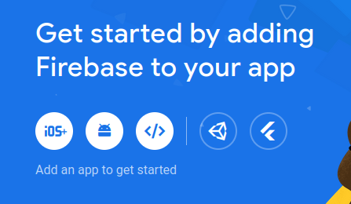
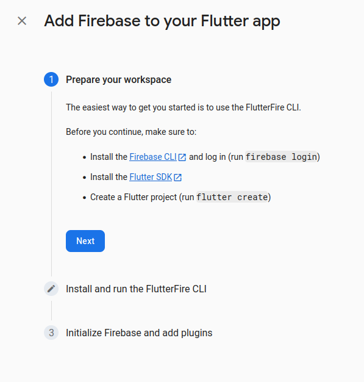

# Firebase auth

Сначала настраиваем firebase, потом пишем две строки в код и побеждаем.

Можно читать этот README.md и продолжать в прошлом проекте, код в точности тот же 

## Делаем приложение в Firebase 

Заходим в [консоль Firebase](https://console.firebase.google.com/u/0/). Жмем на `+` и создаем новый проект (примерно 3 раза нажимаем "Далее"). Google Analytics лишним тоже не будет

Переходим в созданный проект и жмём самую правую кнопку, так же известную как логотип Flutter

 

Лучше официального гайда по установке вряд ли что-то может быть. Так что нужно просто проделать !два предложенных шага. Проект из первого шага создавать не нужно 



Если пока не хотите создавать свой проект, пользуйтесь `mcs-mobdev-flutter` - создано спецаильно для текущего ДЗ.

Проблема может возникнуть вот тут: `flutterfire configure --project=mcs-mobdev-flutter` во втором шаге. Dart сам должен предложить добавить `flutterfire` в $PATH.

За кадром произойдет много штук, в том числе регистрация различных android, mac, ios, и т.д. приложений. Нас интересует `firebase_options.dart`, который будет создан в `lib`

Я тут забыл, что надо в Firebase добавить авторизацию в целом, это должно выглядеть как `Firebase console => Приложение => Menu\Build\Auth => нужный метод авторизации` (*optional* подключение авторизации по ВК?)

Теперь идём в папку с проектом, в частности, нужен `pubspec.yaml`

Первый вариант - запустить `flutter pub add firebase_core`. Другой добавить зависимость руками. Получится: 

```yaml
dependencies:
  flutter:
    sdk: flutter


  # The following adds the Cupertino Icons font to your application.
  # Use with the CupertinoIcons class for iOS style icons.
  cupertino_icons: ^1.0.2
  firebase_core: ^2.20.0
```

После сохранения файла должен автоматически запуститься `flutter pub get`. Нет - запустите руками

Второй пакет, который нужен - `firebase_auth`. Снова: `flutter pub add firebase_auth`

## Снова про dart

Сейчас надо быстро понять `async/await` и `Future<T>`

Полноценно, конечно, в [документации](https://dart.dev/codelabs/async-await). На пальцах: нужна асинхронность (например, запросы в сеть). Чтобы ждать ответ от `foo()` делаем `await foo();`

В синхронной функции `await` не сделаешь, поэтому пишем `async`, а возвращаемый тип меняем с `T` на `Future<T>`:

```dart
void main() {}
//стало
Future<void> main() async {}
```

Пример:

```dart
Future<String> createOrderMessage() async {
  var order = await fetchUserOrder();
  return 'Ваш заказ: $order';
}

Future<String> fetchUserOrder() =>
    // Imagine that this function is
    // more complex and slow.
    Future.delayed(
      const Duration(seconds: 2),
      () => 'Большой латте',
    );

Future<void> main() async {
  print('Выгружаю заказы...');
  print(await createOrderMessage());
}
```

## Обратно к авторизации

Идём в `main.dart`, добавляем импорты и меняем `void main`

```dart
import 'package:firebase_core/firebase_core.dart';
import 'firebase_options.dart';

Future<void> main() async {
  await Firebase.initializeApp(
    options: DefaultFirebaseOptions.currentPlatform,
  );
  runApp(const AuthApp());
}
```

**Важно:** Firebase не поддерживает Linux, запускаться так на Mac/Windows/Android должно быть ок 

**Тоже важно:** если надо запуститься с мобильного устройства

```bash
~$ flutter devices 

2 connected devices:

RMX3630 (mobile) • JFMFFE8H4HBU45NV • android-arm64 • Android 13 (API 33)
Linux (desktop)  • linux            • linux-x64     • Ubuntu 22.04.3 LTS 6.2.0-35-generic

~$ flutter run -d JFM
~$ flutter run linux --release 
```
Так можно выбрать платформу и debug/release сборку. 


Далее, в `analysis_options.yaml` стоит раскомментировать `avoid_print: false`, чтоб всё синим не горело

А теперь с закрытыми глазами пишем 

```dart 
// auth.dart
import 'package:firebase_auth/firebase_auth.dart';

class Auth {
  final FirebaseAuth _auth = FirebaseAuth.instance;

  Future<void> registerWithEmailAndPassword(
      String email, String password) async {
    try {
      await _auth.createUserWithEmailAndPassword(
        email: email,
        password: password,
      );
    } on FirebaseAuthException catch (e) { // не пугаться, это просто dart try-catch
      if (e.code == 'weak-password') {
        print('The password provided is too weak.');
      } else if (e.code == 'email-already-in-use') {
        print('The account already exists for that email.');
      }
    } catch (e) {
      print(e);
    }
  }

  Future<void> signInWithEmailAndPassword(String email, String password) async {
    try {
      await _auth.signInWithEmailAndPassword(
        email: email,
        password: password,
      );
    } on FirebaseAuthException catch (e) {
      if (e.code == 'user-not-found') {
        print('No user found for that email.');
      } else if (e.code == 'wrong-password') {
        print('Wrong password provided for that user.');
      }
    } catch (e) {
      print(e);
    }
  }
}
```

Публичных - два метода - авторизация и регистрация по почте и паролю. Просто верим, что всё работает. За доказательствами, конечно, в [документацию](https://firebase.google.com/docs/auth/flutter/start?hl=en&authuser=0)

Осталось только вернуться в функцию обработки формы и добавить нужный метод

```dart
Future<void> _handleSubmit() async {
    if (_formKey.currentState!.validate()) {
        final email = _emailController.value.text;
        final password = _passwordController.value.text;
        await Auth().signInWithEmailAndPassword(email, password);
    }
}
```

**Не забудьте добавить импорт, если пишите в разных файлах!**

## Делаем апгрейд

Не хотим логиниться при каждом входе. Допишем `AuthApp`

```dart

class AuthApp extends StatelessWidget {
  const AuthApp({super.key});

  @override
  Widget build(BuildContext context) {
    return MaterialApp(
        title: 'Auth Demo',
        debugShowCheckedModeBanner: false,
        theme: ThemeData(
          colorScheme: ColorScheme.fromSeed(seedColor: Colors.deepPurple),
          useMaterial3: true,
        ),
        home: StreamBuilder<User?>( // когда-нибудь я честно напишу, что это такое. пока - поверьте, так правда можно 
          stream: FirebaseAuth.instance.authStateChanges(),
          builder: (context, snapshot) {
            if (snapshot.hasData) {
              return const HomeScreen();
            } else {
              return const AuthScreen();
            }
          },
        ));
  }
}
```

## Упр.

Все же любят вот это математическое *оставим в качестве упражнения*

Выход из аккаунта: утверждается, что его можно сделать по `FirebaseAuth.instance.signOut();`